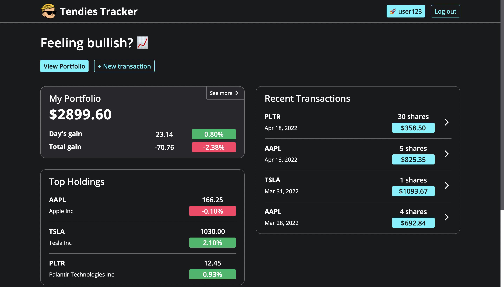
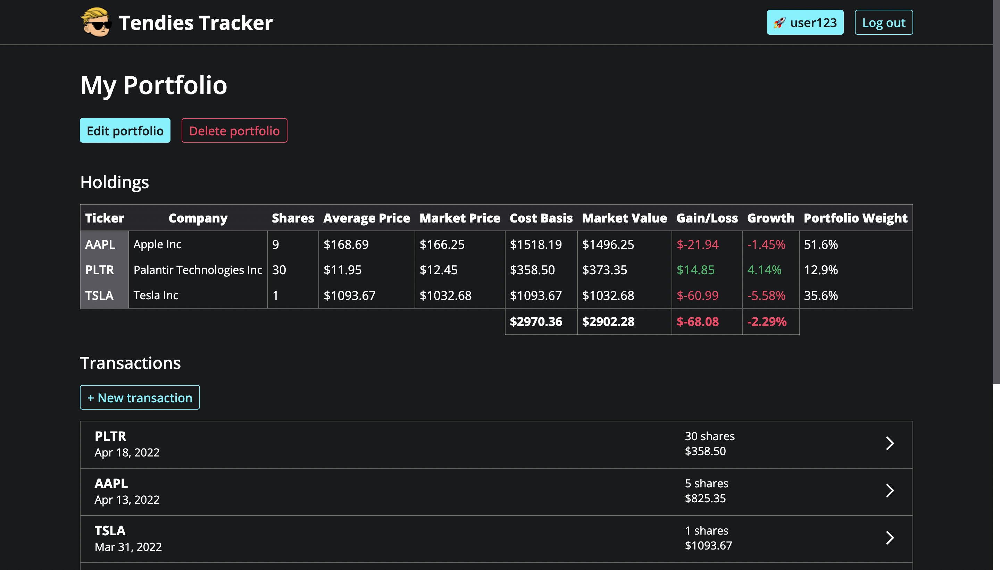

# Tendie Tracker

Keep track of your investment gains or ***tendies*** with this stock portfolio tracker app inspired by [WallStreetBets](https://www.reddit.com/r/wallstreetbets/).

[Live demo](https://tendies-trackr.herokuapp.com/) 👈

## Features

- Real time stock data via the [finnhub API](https://finnhub.io/)
- User authentication via local strategy from [Passport.js](http://www.passportjs.org/)
- Data storage via [MongoDB](https://www.mongodb.com/) and [Moongoose](https://mongoosejs.com/)
- CRUD actions for portfolios and transactions
- Portoflio statistics (daily gain, holding growth, etc.) provided to user on home and portfolio pages

## Functionality

- When a user signs up they are first able to build a new portfolio with a name
- Once a portfolio is created transactions can be added to the portfolio so that it's holdings can be tracked
- Transactions must include a date, stock ticker, shares traded, the average price per share, and the type of transaction (buy/sell)
- Get requests are made to the <code>finnhub API</code> using the portfolio's holiding's stock tickers to get current price and company details (this is currently limited to the index and portfolio detail views only due finnhub's 60req/min rate limit with a free API key)
- On certain pages, popup session messages implemented with <code>express-session</code> provide feedack to the user (sign up complete, successfuly update data, etc.)
- If a user deletes a portfolio, the associated transactions are also deleted, while deleting a user profile removes both the associated portfolio and any transactions

## Screenshots

